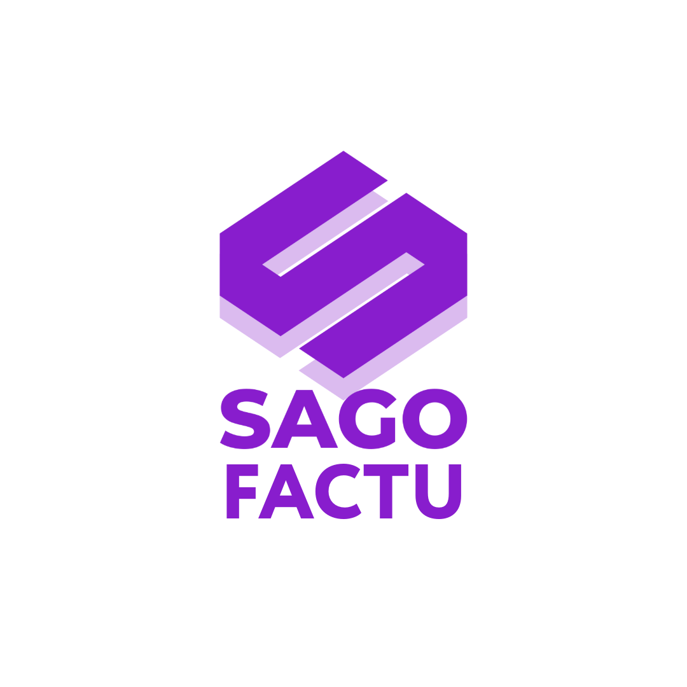

# SAGO FACTU — Plataforma SaaS de Facturación Electrónica para Panamá



<p align="center">
  <a href="https://github.com/angelnereira/sago-factu-V0.2/actions"></a>
  <a href="./CHANGELOG.md"></a>
  <a href="./LICENSE"></a>
  <a href="https://nextjs.org"></a>
  <a href="https://www.prisma.io/"></a>
</p>

---

## 🚀 **VER LA APP EN VIVO**

<div align="center">

### ➡️ **[ACCEDER A SAGO FACTU EN PRODUCCIÓN](https://sago-factu-v0-2.vercel.app/)**

🎯 **Credenciales Demo**:
- **Super Admin**: `admin@sago-factu.com` / `admin123`
- **Usuario Demo**: `usuario@empresa.com` / `usuario123`

</div>

---

## Tabla de Contenidos

- [Estado Actual del Proyecto](#estado-actual-del-proyecto)
- [Resumen Ejecutivo](#resumen-ejecutivo)
- [Características Clave](#características-clave)
- [Stack Tecnológico](#stack-tecnológico)
- [Demo y Capturas](#demo-y-capturas)
- [Quick Start](#quick-start)
- [Testing en Producción](#testing-en-producción)
- [Entorno y Configuración](#entorno-y-configuración)
- [Arquitectura](#arquitectura)
- [Guías de Uso](#guías-de-uso)
- [Deployment](#deployment)
- [Roadmap](#roadmap)
- [Contribuir](#contribuir)
- [Licencia](#licencia)

## Estado Actual del Proyecto

### 🟢 **PRODUCCIÓN LISTA** ✅

**Status**: La aplicación está **en vivo y totalmente funcional** en Vercel.

#### Últimos Hitos Completados (Nov 2025)

- ✅ **Multi-tenancy por Usuario**: Cada usuario puede gestionar sus propias credenciales HKA para ambientes (demo/prod)
- ✅ **Encriptación Segura de Tokens**: AES-256-GCM + PBKDF2 (120k iteraciones) con validación en runtime
- ✅ **Build Production-Ready**: Zero errores de compilación
- ✅ **Deployment Vercel**: Auto-deploy via GitHub con soporte para variables de entorno
- ✅ **Documentación Completa**: Arquitectura, deployment, troubleshooting y guías de desarrollo

#### Verificación Rápida de Salud

```bash
# Build Status
npm run build  # ✅ Completa sin errores

# Test de Encriptación
curl https://sago-factu-v0-2.vercel.app/api/debug/encryption-test
# Response: { "success": true, "match": true }

# Estado de la BD
# PostgreSQL (Neon): Conectada ✅
# Redis (Vercel KV): Disponible para jobs ✅
```

#### Documentación de Fixes Críticos

Para entender los fixes realizados y arquitectura de seguridad, consulta:
- 📄 [Guía de Encriptación](./docs/guides/encryption.md) — Fix crítico de encriptación en runtime
- 📄 [Guía de Deployment Vercel](./docs/deployment/vercel.md) — Guía de deployment
- 📄 [Checklist Production](./docs/quality-assurance/production-checklist.md) — Checklist pre-production

## Resumen Ejecutivo

SAGO FACTU es una plataforma multi-tenant que centraliza la administración de folios y la emisión de facturas electrónicas para empresas panameñas mediante la integración directa con el Proveedor Autorizado de Certificación (PAC) **The Factory HKA**. El proyecto está pensado para entornos enterprise y soporta onboarding rápido, monitoreo en tiempo real y procesamiento asíncrono de documentos.

## Características Clave

- 🚀 **Multi-tenant completo** con aislamiento por organización y roles granularizados.
- 🧾 **Generación y envío de facturas rFE** a HKA, incluyendo validaciones avanzadas y seguimiento.
- 🖋️ **Firma digital XMLDSig multi-tenant** con certificados P12/PFX y PIN cifrado.
- 📦 **Gestión de folios**: compra, asignación y consumo con métricas en dashboard.
- 🔐 **Seguridad enterprise**: NextAuth v5, hashing bcrypt, cifrado de certificados digitales.
- ⚙️ **Procesamiento asíncrono** con BullMQ + Redis para jobs de certificación.
- 📊 **Dashboards y reportes** en tiempo real con gráficas y status detallados.
- ✉️ **Notificaciones automáticas** vía Resend y almacenamiento de XML/PDF en AWS S3.

## Stack Tecnológico

| Capa | Tecnología | Detalles |
|------|------------|----------|
| Frontend & Backend | Next.js 15 App Router, React 19, TypeScript 5 | Componentes shadcn/ui, Tailwind CSS 4 |
| Base de datos | PostgreSQL 15 (Neon Serverless) | Prisma ORM 6.17 con extensiones Accelerate, cifrado de campos |
| Autenticación | NextAuth.js v5 (Credentials) | JWT, callbacks personalizadas, roles multi-tenant |
| Integraciones | node-soap, AWS SDK v3, Resend | Cliente SOAP HKA, gestión de certificados p12/pfx |
| Jobs & Caché | BullMQ 5 + Redis | Workers para certificación y sincronizaciones |
| DevOps | Docker, Docker Compose, GitHub Actions (blueprint) | Scripts de setup y diagnostico |

Consulta la documentación ampliada en `docs/architecture/overview.md`.

## Demo y Capturas

> Añade tus capturas oficiales en `public/screenshots/` y enlázalas aquí para personalizar la demo visual del proyecto.

## Quick Start

### Opción A: Acceder a la Demo en Vivo (Recomendado)

No necesitas instalar nada. Solo:

1. **Abre** [https://sago-factu-v0-2.vercel.app/](https://sago-factu-v0-2.vercel.app/) en tu navegador
2. **Inicia sesión** con las credenciales demo:
   - Super Admin: `admin@sago-factu.com` / `admin123`
   - Usuario Demo: `usuario@empresa.com` / `usuario123`
3. **Prueba las funcionalidades** (crear facturas, gestionar credenciales HKA, ver reportes, etc.)

### Opción B: Desarrollo Local

Para contribuir o hacer cambios locales:

```bash
git clone https://github.com/angelnereira/sago-factu-V0.2.git
cd sago-factu
npm install
cp .env.example .env
npm run setup && npm run db:migrate && npm run db:seed
npm run dev
```

Luego accede a `http://localhost:3000` con las credenciales demo arriba mencionadas.

## Testing en Producción

### Guía Completa: [docs/quality-assurance/testing.md](./docs/quality-assurance/testing.md)

**Si accediste a la app en vivo y quieres probar la funcionalidad crítica de encriptación de credenciales HKA:**

#### Test Rápido (5 minutos)

1. **Inicia sesión** en https://sago-factu-v0-2.vercel.app/ con:
   ```
   usuario@empresa.com / usuario123
   ```

2. **Navega a** Settings → HKA Credentials Configuration

3. **Ingresa credenciales demo**:
   - Token User: `demo_user_test`
   - Token Password: `demo_password_test_123`
   - Environment: `Demo`

4. **Haz clic en Save** y verifica que:
   - ✅ Se guarden sin error
   - ✅ Persistan después de recarga
   - ✅ El token password no sea visible (está encriptado)

Si todo funciona, ¡la encriptación AES-256-GCM está operativa en producción! 🎉

**Para testing más detallado**, consulta [docs/quality-assurance/testing.md](./docs/quality-assurance/testing.md) con:
- Testing de todas las funcionalidades
- Verificación de infraestructura
- Debugging de errores comunes
- Checklist de validación

## Entorno y Configuración

1. Requisitos mínimos: Node.js 20, Docker 24, PostgreSQL 15, Redis 7.
2. Revisa `.env.example` y ajusta las variables obligatorias.
3. Para scripts de automatización consulta `docs/guides/development-workflow.md`.
4. Guías de setup detallado en:
   - `docs/setup/installation.md`
   - `docs/setup/environment-setup.md`
   - `docs/setup/database-setup.md`

## Arquitectura

- **Monolito Next.js** con server actions, rutas API y middleware para control de acceso.
- **Capas principales**: `app/*` (UI y APIs), `lib/*` (servicios y utilidades), `components/*` (UI reusables), `prisma/*` (schema y seeds).
- **Integración HKA** encapsulada en `lib/hka/*` con transformers, clientes SOAP y validadores XML.
- **Jobs** (`lib/queue`, `lib/workers`) manejan la certificación y procesos intensivos.
- **Monitorización** vía módulos en `lib/monitoring` y paneles en `app/dashboard`.

Consulta `docs/architecture/overview.md` y `docs/architecture/tech-decisions.md` para diagramas y decisiones clave.

## Guías de Uso

### Probar Credenciales HKA en Producción

Si deseas verificar que la encriptación de credenciales funciona correctamente en la app en vivo:

1. **En producción**: Navega a `Settings → HKA Credentials Configuration`
2. **Ingresa credenciales demo**:
   ```
   Token User: demo_user_test
   Token Password: demo_password_test_123
   Environment: Demo
   ```
3. **Haz clic en Save** y verifica que se guarden sin errores
4. **Verifica persistencia**: Recarga la página y comprueba que los datos se mantienen

Esta funcionalidad demuestra:
- ✅ Encriptación AES-256-GCM funcionando en runtime
- ✅ Multi-tenancy por usuario (cada usuario tiene sus propias credenciales)
- ✅ Persistencia en PostgreSQL (Neon)
- ✅ Seguridad enterprise con PBKDF2

### Documentación de Desarrollo

- **Workflow de desarrollo**: [docs/guides/development-workflow.md](./docs/guides/development-workflow.md)
- **API HTTP + Webhooks**: [docs/guides/api-documentation.md](./docs/guides/api-documentation.md)
- **Testing (unit + integration + E2E)**: [docs/quality-assurance/testing.md](./docs/quality-assurance/testing.md)
- **Migraciones y seeds**: [docs/database/migrations.md](./docs/database/migrations.md) y [docs/database/seeds.md](./docs/database/seeds.md)
- **Backup & restore**: [docs/database/backup-restore.md](./docs/database/backup-restore.md)
- **Guía de Encriptación**: [docs/guides/encryption.md](./docs/guides/encryption.md)

## Deployment

| Plataforma | Documento | Contenido |
|------------|-----------|-----------|
| Docker | `docs/deployment/docker.md` | Imágenes multi-stage, docker-compose, healthchecks |
| Oracle Cloud | `docs/deployment/oracle-cloud.md` | Configuración de compute, redes, CI/CD |
| Google Cloud | `docs/deployment/google-cloud.md` | Cloud Run / Compute Engine, Cloud SQL, IAM |

Scripts de despliegue adicionales en `vercel-build.sh` y `scripts/`.

## Roadmap

- [x] Multi-tenancy con roles avanzados
- [x] Generación y certificación XML rFE
- [x] Dashboard de monitoreo de folios y facturas
- [ ] Integración directa con pasarelas de pago
- [ ] Portal de clientes auto-servicio
- [ ] Pipeline CI/CD en GitHub Actions
- [ ] Alertas en tiempo real con WebSockets

Consulta el detalle en `CHANGELOG.md` y abre un issue para proponer nuevas funcionalidades.

## Contribuir

Aceptamos contribuciones externas siguiendo la guía oficial:

- Lee [docs/contributing/CONTRIBUTING.md](./docs/contributing/CONTRIBUTING.md) para conocer estándares de código, convenios de commits y flujo de PR.
- Usa [docs/contributing/code-style.md](./docs/contributing/code-style.md) para formateo y patrones aceptados.
- Aplica la plantilla [docs/contributing/pull-request-template.md](./docs/contributing/pull-request-template.md) al abrir un PR.

### Scripts útiles

```bash
npm run lint             # Linting con ESLint + reglas personalizadas
npm run test             # Suite completa (unit + integration)
npm run test:unit        # Validaciones y utilidades
npm run test:integration # Importación de Excel y flujos críticos
npm run db:reset         # Reset completo + seed demo
```

## Licencia

Este proyecto se distribuye bajo licencia [MIT](./LICENSE). Consulta el documento para conocer los términos completos.

---

## Observaciones Importantes

### Sobre la App en Producción

La aplicación en [https://sago-factu-v0-2.vercel.app/](https://sago-factu-v0-2.vercel.app/) está **completamente funcional** y lista para demostración:

- **Base de datos**: PostgreSQL en Neon (conectada y operativa)
- **Autenticación**: NextAuth v5 con credenciales demo pre-cargadas
- **Encriptación**: AES-256-GCM con validación en runtime (Fix Nov 2025)
- **Integraciones**: HKA, AWS S3, Resend (configuradas)
- **Monitoreo**: Dashboards, reportes y estadísticas en tiempo real

### Próximos Pasos Recomendados

Si deseas continuar con el desarrollo:

1. **Testear funcionalidad de credenciales**:
   - Accede a la app en producción
   - Ve a Settings → HKA Credentials Configuration
   - Guarda credenciales demo y verifica que persistan

2. **Revisar documentación de arquitectura**:
   - [docs/architecture/credentials.md](./docs/architecture/credentials.md)
   - [docs/guides/encryption.md](./docs/guides/encryption.md)

3. **Para cambios locales**:
   - Clone el repo
   - Sigue la guía de "Desarrollo Local" arriba
   - Los cambios se sincronizarán automáticamente con Vercel via GitHub

### Debugging y Troubleshooting

En caso de problemas con encriptación:
- Revisa [docs/deployment/status.md](./docs/deployment/status.md)
- Verifica que `ENCRYPTION_KEY` esté configurado en Vercel
- Consulta los logs en Vercel → Functions Analytics

---

**SAGO FACTU** — Enterprise Billing Platform for Panamá
🚀 En vivo en: [https://sago-factu-v0-2.vercel.app/](https://sago-factu-v0-2.vercel.app/)
Construido con ❤️ por el equipo de UbicSystem. Para soporte escribe a `soporte@sago-factu.com`.
---

## 📚 **Documentación Centralizada**

**[👉 Ir al Centro de Documentación](./docs/INDEX.md)**

Toda la documentación está organizada en `/docs` para fácil navegación:

- **[Inicio Rápido](./docs/START-HERE.md)** - Para nuevos desarrolladores (5 min)
- **[Arquitectura](./docs/architecture/overview.md)** - Cómo funciona internamente
- **[Guías de Desarrollo](./docs/guides/)** - Firma digital, APIs, Testing
- **[Despliegue](./docs/deployment/)** - Docker, Vercel, Cloud
- **[Contribuir](./docs/contributing/)** - Cómo colaborar

**Documentos Ejecutivos** (para inversores/stakeholders):
- [Resumen Ejecutivo](./docs/business/BLUEPRINT-RESUMEN-EJECUTIVO.md)
- [Modelo de Negocio](./docs/business/BLUEPRINT-MODELO-NEGOCIO.md)
- [Características Técnicas](./docs/business/BLUEPRINT-FEATURES-TECNICAS.md)

**Integración & HKA**:
- [The Factory HKA - Brief Técnico](./docs/integrations/THE-FACTORY-HKA-TECHNICAL-BRIEF.md)
- [Plantilla de Email para HKA](./docs/integrations/EMAIL-TEMPLATE-THE-FACTORY-HKA.md)

---

**Ver [docs/DOCUMENTACION-REFINADA.md](./docs/DOCUMENTACION-REFINADA.md) para información sobre la reorganización de documentación.**

