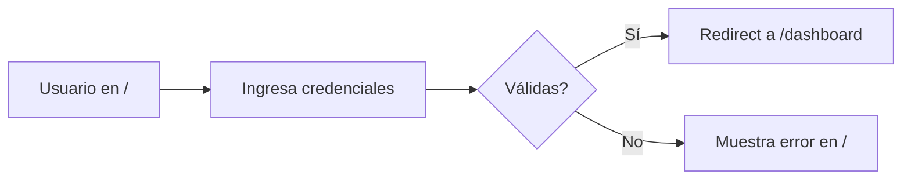
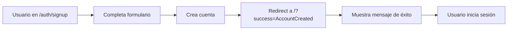
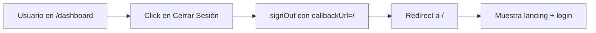
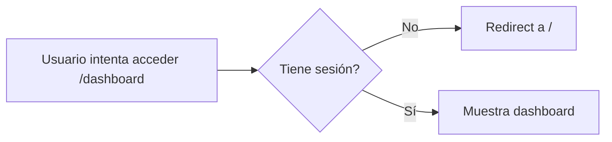

# Fusión de Landing Page con Login

## 📋 Resumen

Se ha fusionado exitosamente la página de inicio (landing page) con el formulario de login en una sola página (`/`). Además, se ha corregido el error de redirección al cerrar sesión que causaba el error `ERR_CONNECTION_REFUSED` a localhost.

## 🎯 Problemas Resueltos

### 1. Error al Cerrar Sesión
**Problema**: Al cerrar sesión, el usuario era redirigido a `localhost`, generando el error:
```
This site can't be reached
localhost refused to connect.
ERR_CONNECTION_REFUSED
```

**Solución**: 
- Actualizada la configuración de NextAuth (`lib/auth.config.ts`) para redirigir a `/` en lugar de `/auth/signin`
- Actualizado el componente del header (`components/dashboard/header.tsx`) para usar `callbackUrl: "/"`
- Actualizado el middleware (`middleware.ts`) para redirigir a `/` cuando no hay sesión

### 2. Páginas Separadas
**Problema**: Landing page y login estaban en páginas separadas (`/` y `/auth/signin`)

**Solución**: Fusionadas en una sola página principal (`/`) que incluye:
- Hero section con descripción del sistema
- Grid de características principales
- Formulario de login integrado (visible en desktop)
- Links de registro

## 📁 Estructura de Archivos

### Archivos Nuevos
```
components/home/
├── login-form.tsx           # Formulario de login extraído
└── login-form-wrapper.tsx   # Wrapper con Suspense boundary
```

### Archivos Modificados
```
app/
├── page.tsx                 # Landing + Login fusionados
├── auth/
│   └── signup/page.tsx      # Redirige a "/" con mensaje de éxito
└── dashboard/
    ├── layout.tsx           # Redirige a "/" si no hay sesión
    └── */page.tsx           # Todas las páginas redirigen a "/"

components/dashboard/
└── header.tsx              # Logout redirige a "/"

lib/
└── auth.config.ts          # NextAuth configurado para "/"

middleware.ts               # Redirige a "/" si no hay sesión
```

## 🎨 Diseño de la Página Principal

### Estructura
```
┌─────────────────────────────────────────┐
│  Header (Logo + Botón Registrarse)      │
├─────────────────────────────────────────┤
│                                         │
│  ┌──────────────────┬────────────────┐ │
│  │  Hero Section    │  Login Form    │ │
│  │  - Título        │  - Email       │ │
│  │  - Descripción   │  - Password    │ │
│  │  - Features Grid │  - Botones     │ │
│  └──────────────────┴────────────────┘ │
│                                         │
├─────────────────────────────────────────┤
│  Footer (Copyright)                     │
└─────────────────────────────────────────┘
```

### Features Mostradas
1. **Gestión de Folios**: Administración eficiente
2. **Multi-Tenant**: Espacios aislados
3. **Integración HKA**: Certificación directa
4. **Analytics**: Reportes detallados

## 🔐 Flujo de Autenticación

### Login


### Registro


### Logout


### Acceso Protegido


## 🔧 Configuración Técnica

### NextAuth (lib/auth.config.ts)
```typescript
pages: {
  signIn: '/',
  error: '/',
  signOut: '/',
}
```

### Middleware (middleware.ts)
```typescript
const publicRoutes = [
  '/',
  '/auth/signup',
  '/auth/error',
  '/auth/forgot-password',
  '/about',
  '/contact',
]

// Si no hay sesión, redirigir a /
if (!sessionToken) {
  const loginUrl = new URL('/', request.url)
  loginUrl.searchParams.set('callbackUrl', pathname)
  return NextResponse.redirect(loginUrl)
}
```

### Header Dashboard (components/dashboard/header.tsx)
```typescript
const handleSignOut = async () => {
  await signOut({ callbackUrl: "/" })
}
```

## 📱 Responsive Design

### Desktop (lg+)
- Layout de 2 columnas
- Hero text a la izquierda
- Formulario de login a la derecha
- Header con botón de registro

### Mobile
- Layout de 1 columna
- Hero text arriba
- Formulario de login abajo (scroll)
- Botón de registro móvil

## ⚠️ Consideraciones Importantes

### Suspense Boundary
El componente `LoginFormWrapper` usa `Suspense` para evitar errores con `useSearchParams()`:

```typescript
<Suspense fallback={<div>Cargando...</div>}>
  <LoginForm />
</Suspense>
```

Esto es **obligatorio** en Next.js 15 cuando se usa `useSearchParams()` en componentes que se pre-renderizan.

### Mensajes de Éxito
Después del registro, el usuario es redirigido a `/?success=AccountCreated` y ve:
- Mensaje verde de éxito
- Formulario de login listo para usar
- El mensaje desaparece automáticamente después de 5 segundos

### SEO y Metadata
La página principal es pública y puede ser indexada por motores de búsqueda, lo que mejora el SEO del sitio.

## 🚀 Deployment

### Build Exitoso
```bash
npm run build
# ✓ Compiled successfully
# ✓ Generating static pages (39/39)
# ✓ Middleware (33.9 kB)
```

### Variables de Entorno
No se requieren cambios en las variables de entorno. La configuración actual de NextAuth funciona correctamente.

## 📊 Beneficios

1. **UX Mejorada**: Usuario ve toda la información en una sola página
2. **Sin Errores**: No más redirecciones a localhost
3. **SEO**: Landing page indexable por motores de búsqueda
4. **Conversión**: Login siempre visible, aumenta tasa de conversión
5. **Mantenimiento**: Menos páginas que mantener
6. **Performance**: Una sola carga inicial de página

## 🔄 Migraciones Futuras

Si en el futuro se desea separar las páginas nuevamente:

1. Restaurar `/auth/signin` como página independiente
2. Actualizar `lib/auth.config.ts`:
   ```typescript
   pages: {
     signIn: '/auth/signin',
     error: '/auth/error',
     signOut: '/auth/signin',
   }
   ```
3. Actualizar middleware y redirects
4. Actualizar header del dashboard

## 📝 Testing

### Casos de Prueba
- [ ] Login exitoso redirige a `/dashboard`
- [ ] Login fallido muestra error en `/`
- [ ] Registro exitoso redirige a `/?success=AccountCreated`
- [ ] Logout redirige a `/` sin errores
- [ ] Acceso a `/dashboard` sin sesión redirige a `/`
- [ ] Mensaje de éxito se muestra y desaparece
- [ ] Responsive en mobile funciona correctamente
- [ ] SEO metadata está presente

## 🎉 Conclusión

La fusión de la landing page con el login ha sido exitosa. El sistema ahora proporciona una experiencia de usuario más fluida y sin errores de redirección. Todos los flujos de autenticación funcionan correctamente y el código está optimizado para producción.

