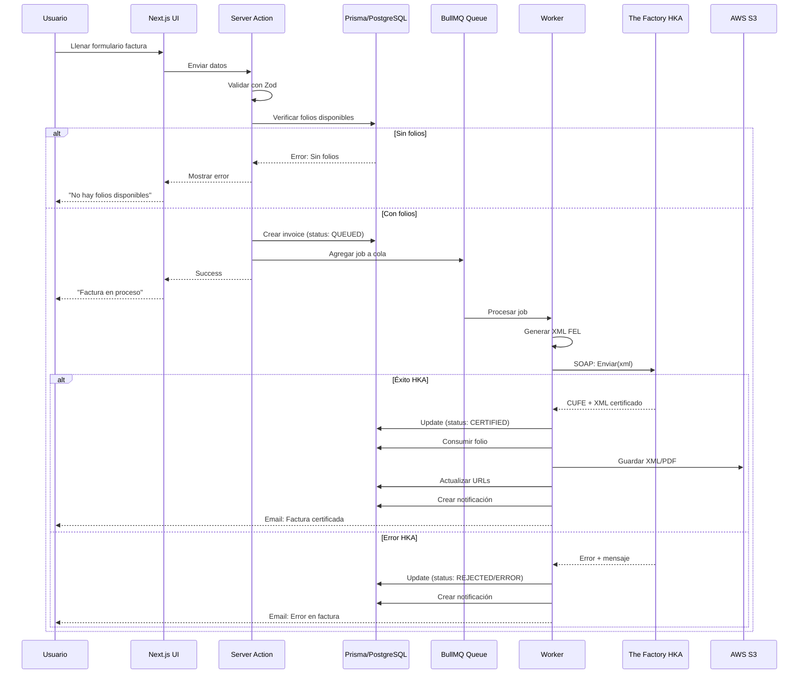
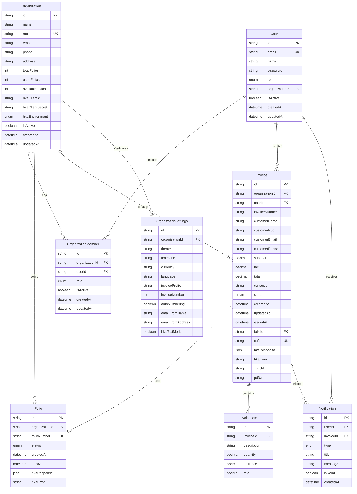
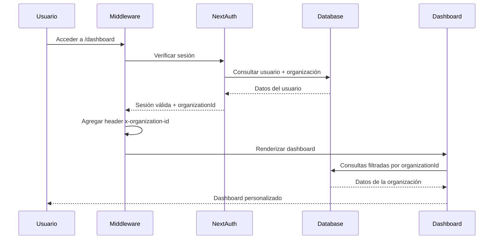
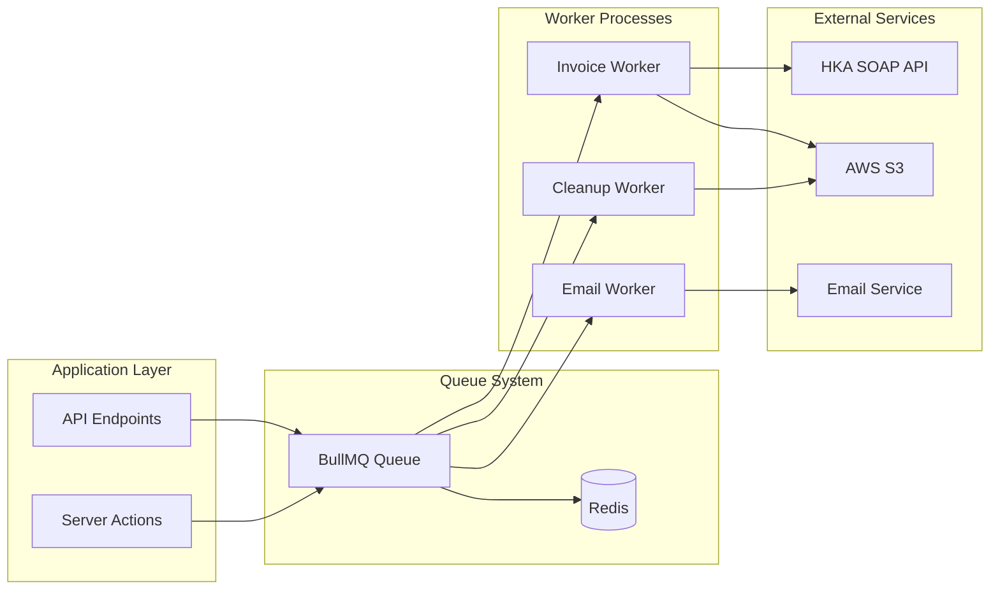
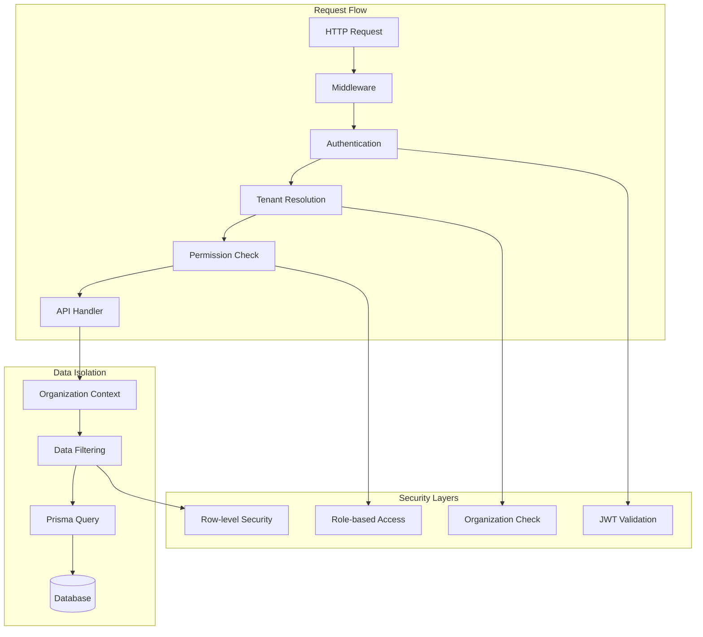

# Arquitectura del Sistema SAGO-FACTU

## Diagrama de Arquitectura General

```mermaid
graph TB
    subgraph "Client Layer"
        WEB[Web App - Next.js]
        MOBILE[Mobile - Progressive Web App]
    end
    
    subgraph "API Layer - Next.js App Router"
        API[/api Routes]
        SA[Server Actions]
        MW[Middleware - Auth & Multi-Tenant]
    end
    
    subgraph "Business Logic Layer"
        AUTH[Auth Service]
        FOLIO[Folio Management]
        INVOICE[Invoice Processing]
        HKA_CLIENT[HKA SOAP Client]
    end
    
    subgraph "Data Layer"
        PRISMA[(Prisma ORM)]
        POSTGRES[(PostgreSQL)]
        REDIS[(Redis - Queue)]
    end
    
    subgraph "External Services"
        HKA[The Factory HKA SOAP API]
        S3[AWS S3 Storage]
        EMAIL[Email Service]
    end
    
    subgraph "Background Processing"
        QUEUE[BullMQ Queue]
        WORKERS[Queue Workers]
    end
    
    WEB --> API
    WEB --> SA
    MOBILE --> API
    
    API --> MW
    SA --> MW
    MW --> AUTH
    MW --> FOLIO
    MW --> INVOICE
    
    AUTH --> PRISMA
    FOLIO --> PRISMA
    INVOICE --> PRISMA
    INVOICE --> HKA_CLIENT
    
    HKA_CLIENT --> QUEUE
    QUEUE --> WORKERS
    WORKERS --> HKA
    
    PRISMA --> POSTGRES
    QUEUE --> REDIS
    
    INVOICE --> S3
    INVOICE --> EMAIL
    
    HKA -.respuesta.-> WORKERS
    WORKERS -.actualizar.-> PRISMA
```

## Flujo de Emisión de Factura



## Modelo de Datos Multi-Tenant



## Flujo de Autenticación Multi-Tenant



## Arquitectura de Colas y Workers



## Patrones de Seguridad Multi-Tenant


